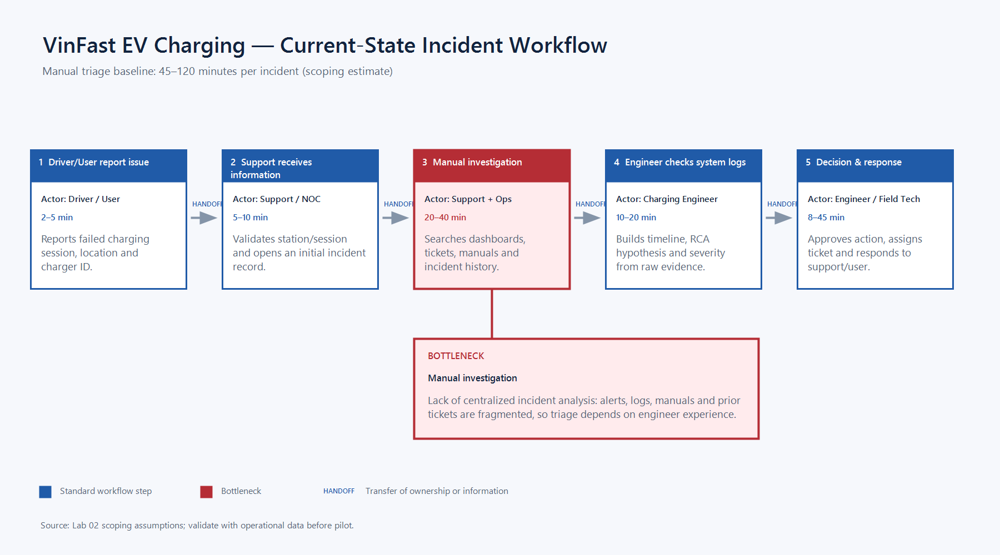

# Lab 02 — Deep-Dive Report

## AI Incident Intelligence cho trạm sạc EV VinFast

### Executive summary

Đội vận hành hiện phải ghép thủ công cảnh báo, log, session, manual và incident history trước khi đánh giá severity hoặc đề xuất xử lý. Giải pháp được đề xuất là một **decision-support copilot**: Rule Engine phát hiện tín hiệu xác định; LLM + RAG tạo incident summary, draft RCA và mitigation có dẫn nguồn; kỹ sư giữ toàn bộ quyền phê duyệt hành động. Phạm vi pilot chỉ áp dụng cho nhóm lỗi đã có runbook và không cho AI thay đổi infrastructure.

## 1. Current-State Workflow

**Actors:** Driver/User, support/NOC operator, charging operation engineer và field technician.

| Bước | Actor | Hoạt động hiện tại | Input → Output | Thời gian ước lượng | Handoff / Bottleneck |
|---:|---|---|---|---:|---|
| 1 | Driver/User hoặc monitoring system | Báo phiên sạc lỗi/cảnh báo charger | Mô tả, charger ID, timestamp → issue report | 2–5 phút | 🔄 User/System → Support/NOC |
| 2 | Support/NOC operator | Tiếp nhận, xác minh trạm/session và mở incident | Issue report → incident record ban đầu | 5–10 phút | 🔄 Support → Charging Operations |
| 3 | Support/NOC + charging operation engineer | Điều tra thủ công qua dashboard, ticket và tài liệu rời rạc | Alert/log/ticket → timeline sơ bộ | 20–40 phút | 🔴 **Bottleneck:** manual investigation; chưa có incident analysis tập trung |
| 4 | Charging operation engineer | Kiểm tra system logs, error code, session và incident history | Raw evidence → RCA hypothesis + severity | 10–20 phút | Phụ thuộc kinh nghiệm; dễ thiếu context |
| 5 | Engineer / field technician | Quyết định, tạo ticket, phản hồi và thực hiện action đã duyệt | RCA + runbook → approved action/response | 8–45 phút | 🔄 Engineer → Field technician/Support |

**Tổng thời gian hiện tại:** khoảng **45–120 phút/incident** để có chẩn đoán và phương án ban đầu, chưa gồm thời gian di chuyển hoặc sửa chữa tại trạm.

> Các con số là giả định scoping. Baseline chính thức cần đo từ tối thiểu bốn tuần dữ liệu, tách theo severity và nhóm lỗi.

## 2. Problem Statement (6-field)

| Field | Nội dung |
|---|---|
| **1. Actor** | NOC operator tiếp nhận/triage; charging operation engineer đánh giá severity, RCA và mitigation; field technician xác minh/khắc phục tại trạm. Khách hàng là stakeholder chịu tác động khi phiên sạc thất bại. |
| **2. Context** | Mạng lưới trạm sạc tạo dữ liệu từ charger, backend, payment và session systems. Incident có thể ảnh hưởng một cổng, toàn trạm hoặc nhiều khách hàng; quyết định sai có thể kéo dài downtime hoặc tạo rủi ro an toàn. |
| **3. Current workflow** | Alert hoặc báo cáo người dùng → NOC xác minh charger/session → điều tra thủ công trên nhiều dashboard → engineer đọc log, manual/runbook và ticket cũ → đánh giá severity → tạo ticket, giao người xử lý và phản hồi. |
| **4. Pain point** | Log phân tán, thiếu context chuẩn hóa và khó tìm incident tương tự. RCA ban đầu phụ thuộc kinh nghiệm cá nhân; alert trùng, timeline thiếu hoặc tài liệu sai phiên bản làm bước điều tra mất **20–40 phút/incident**. |
| **5. Impact** | Triage chậm kéo dài downtime, làm tăng nguy cơ trễ SLA, số phiên sạc thất bại, tải CSKH và chi phí kỹ thuật hiện trường. Với tổng cycle time **45–120 phút/incident**, mỗi handoff thiếu thông tin tiếp tục kéo dài thời gian khách hàng không thể sạc. Tác động doanh thu cần được lượng hóa bằng session và downtime thực tế trong pilot. |
| **6. Success metric** | Median time-to-triage **30 phút → < 10 phút**; downtime trung bình của nhóm lỗi đã có runbook giảm **20–30%**; severity cao đạt **precision ≥ 90%, recall ≥ 95%**; **≥ 90%** summary đúng charger/session ID, timeline và citation khi audit; **100%** action rủi ro có human approval. |

## 3. Future-State Workflow

Data ingestion: telemetry, logs, payment/session events và user report 
↓ 
**🔵 Rule-based detection:** Chuẩn hóa schema, deduplicate alert, kiểm tra threshold và known error 
↓ 
**🔵 LLM RCA assistant + RAG:** Tạo timeline/incident summary, truy xuất runbook/manual/history và draft RCA có citation + confidence 
↓ 
**🔵 Recommendation draft:** Đề xuất mitigation/checklist dưới dạng nháp; không thực thi command 
↓ 
**🟢 Human approval:** Engineer kiểm tra evidence, sửa severity/RCA và phê duyệt hoặc từ chối action 
↓ 
**Action:** Operator/field technician thực hiện action được duyệt, ghi outcome vào incident database để audit

### Phân vai Rule, LLM/RAG và Agent

| Thành phần | Dùng cho | Không dùng cho |
|---|---|---|
| **Rule** | Threshold, fixed alert, known error, deduplication, mandatory safety guardrail. | Diễn giải chuỗi log mơ hồ hoặc kết luận RCA nhiều nguồn. |
| **LLM** | Summarize incident, dựng timeline, draft RCA và mitigation bằng ngôn ngữ vận hành. | Tự tạo evidence, tự chọn action cuối cùng hoặc điều khiển infrastructure. |
| **RAG** | Grounding bằng manual/runbook đúng phiên bản, maintenance history và incident tương tự; trả citation. | Thay thế xác minh của engineer khi nguồn thiếu hoặc mâu thuẫn. |
| **Agent** | Chỉ cân nhắc khi cần orchestration nhiều bước giữa telemetry, ticketing và asset management. | Không cần trong pilot; không cấp quyền reset, đổi config, dispatch hoặc đóng incident. |

**Architecture đề xuất:** **Rule + LLM + RAG**. Agent chưa cần thiết vì scope pilot là decision support, không phải autonomous operations.

## 4. Human-in-the-loop và Operational Boundary

### AI được phép

- Tổng hợp alert/log và dựng timeline.
- Tìm incident tương tự và tài liệu đúng phiên bản.
- Draft RCA, severity và mitigation kèm evidence, citation và confidence.
- Đánh dấu dữ liệu thiếu/mâu thuẫn để engineer kiểm tra.

### AI không được phép

- Tự reset charger, đổi firmware/config, thay threshold hoặc cô lập/khôi phục thiết bị.
- Tự dispatch kỹ thuật viên, gửi instruction cho khách hàng hoặc thực hiện command thật.
- Tự đóng incident nghiêm trọng hoặc khẳng định RCA khi không đủ bằng chứng.

### Điểm duyệt bắt buộc

- NOC/operator xác nhận incident và severity.
- Charging operation engineer duyệt RCA và mọi mitigation/action.
- Người có thẩm quyền duyệt reset, config change, isolation, dispatch và closure của incident nghiêm trọng.
- Hệ thống lưu người duyệt, timestamp, evidence và action để audit.

## 5. Fallback & Failure Handling

| Failure condition | Detection | Fallback |
|---|---|---|
| LLM timeout/không trả kết quả | Timeout hoặc API error | Tiếp tục **rule-based alert**; NOC xử lý theo manual workflow. |
| Thiếu charger/session ID hoặc log bắt buộc | Validation trước inference | Không draft RCA; yêu cầu bổ sung dữ liệu và chuyển manual investigation. |
| Không tìm thấy tài liệu đúng phiên bản | RAG trả 0 nguồn đạt ngưỡng | Hiển thị “insufficient evidence”; engineer tra kho tài liệu chính thức. |
| Nguồn mâu thuẫn hoặc confidence thấp | Citation/confidence check | Không đưa action recommendation; escalate charging operation engineer. |
| Output vi phạm schema/boundary | Deterministic output validator | Loại output, giữ raw evidence và dùng rule/manual operation. |
| Engineer không đồng ý đề xuất | Human rejection | Engineer sửa RCA/action; lưu feedback đã review, không tự học từ feedback chưa kiểm duyệt. |

## 6. Evaluation & Decision

### AI Readiness Checklist

| Tiêu chí | Trạng thái | Bằng chứng / việc cần làm |
|---|---|---|
| Có dữ liệu mẫu/log để test | **Có điều kiện** | Telemetry, logs và ticket có khả năng tồn tại; cần kiểm tra quyền truy cập, schema, PII và chất lượng bốn tuần dữ liệu. |
| Rủi ro khi AI sai kiểm soát được | **Có** | Output chỉ là draft; validator, confidence threshold, citation, HITL và manual fallback được định nghĩa. |
| Stakeholder sẵn sàng đổi workflow | **Chưa xác nhận** | Cần workshop với NOC/engineer và shadow-mode pilot trước khi tích hợp vào ticketing. |
| Metric và baseline đo được | **Có điều kiện** | Metric đã có số; baseline 30 phút và 45–120 phút cần xác nhận từ incident history. |

### GO / NOT YET / NO-GO

| Quyết định | Chọn? | Lý do |
|---|:---:|---|
| **GO — Guarded Pilot** | **✓** | Bài toán cụ thể, dữ liệu có thể audit, metric rõ và rủi ro được giới hạn bằng read-only access + HITL. Pilot chỉ cho nhóm lỗi đã có runbook, chạy shadow mode trước. |
| **NOT YET** |  | Chọn phương án này nếu dữ liệu bốn tuần không đủ coverage, citation quality thấp hoặc stakeholder chưa thống nhất workflow. |
| **NO-GO** |  | Chỉ chọn nếu rule-only đã đạt mục tiêu tương đương hoặc không thể bảo vệ dữ liệu/quyền vận hành. |

### Điều kiện Go/No-Go sau pilot

- **Go mở rộng** khi đạt time-to-triage < 10 phút, severity high recall ≥ 95%, citation audit ≥ 90% và không có unauthorized action.
- **Dừng/thu hẹp** nếu AI tạo evidence, vi phạm boundary, làm recall severity cao dưới ngưỡng hoặc không tạo cải thiện có ý nghĩa so với rule-only baseline.
- Pilot không tự động hóa action; mọi thay đổi infrastructure tiếp tục do con người thực hiện.
